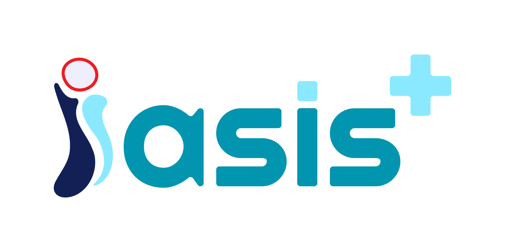
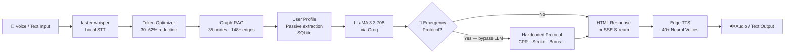
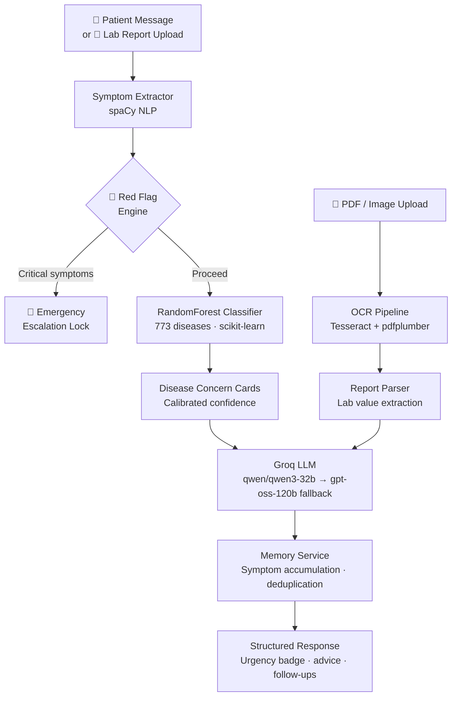
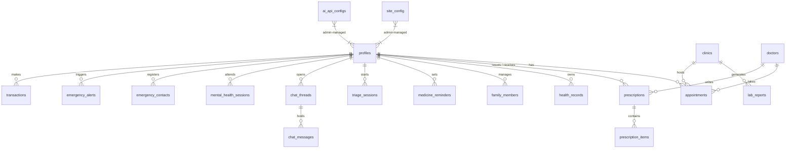

<div align="center">



# IASIS AI

### National Healthcare Intelligence Platform

*Iasis (Ίασις) = Healing · AI = Intelligence*

[](https://nextjs.org)
[](https://react.dev)
[](https://typescriptlang.org)
[](https://python.org)
[](https://fastapi.tiangolo.com)
[](https://supabase.com)
[](LICENSE)

<br/>

**One Citizen — One Medical Profile.**

A unified, production-ready AI healthcare platform for Bangladesh — combining a full-stack multi-role web portal, an AI health companion, and a conversational triage & lab report analyzer into a single integrated system.

<br/>

| 74 App Pages | 104 UI Components | 25 Database Tables | 773 Diseases Modeled | 200 Clinical Topics | 13 Emergency Protocols |
|:---:|:---:|:---:|:---:|:---:|:---:|

</div>

---

## Table of Contents

- [System Architecture](#system-architecture)
- [Modules](#modules)
  - [1. Core Platform](#1-core-platform)
  - [2. RISA — AI Health Companion](#2-risa--ai-health--mental-wellness-companion)
  - [3. Report Checking AI](#3-report-checking-ai--conversational-triage--report-analyzer)
- [Database Schema](#database-schema)
- [Repository Layout](#repository-layout)
- [Getting Started](#getting-started)
- [Security](#security)
- [Contributing](#contributing)
- [License](#license)

---

## System Architecture

```mermaid
graph TB
    subgraph Client["👤 Client Layer"]
        U1[Patient]
        U2[Doctor]
        U3[Clinic / Lab]
        U4[Admin]
    end

    subgraph Core["🌐 Core Platform · Next.js 16 · App Router"]
        CP1[Patient Portal]
        CP2[Doctor Portal]
        CP3[Clinic Portal]
        CP4[Admin Dashboard]
        CP5[AI Chat & Triage]
        CP6[Mental Health Module]
        PROXY[proxy.ts · Session Middleware]
    end

    subgraph Data["🗄️ Data Layer"]
        SB[(Supabase · Postgres + RLS)]
        R2[Cloudflare R2 · Object Storage]
    end

    subgraph AIGateway["⚡ AI Gateway · Vercel"]
        GW[AI SDK Gateway]
    end

    subgraph RISA["🧠 RISA · FastAPI · Python"]
        RB[backend.py · REST + SSE]
        RLLM[LLaMA 3.3 70B · Groq]
        RVEC[ChromaDB · Vector RAG]
        RGRAPH[NetworkX · Graph-RAG]
        RTTS[Edge TTS · 40+ voices]
        RSTT[faster-whisper · Local STT]
        RPROFILE[SQLite · Passive Profiling]
    end

    subgraph ReportAI["📋 Report Checking AI · FastAPI + React"]
        RAB[FastAPI Backend]
        RALLM[Groq LLM · 32B–120B]
        RAML[RandomForest · 773 diseases]
        RAOCR[Tesseract + pdfplumber · OCR]
        RAUI[React + Vite Frontend]
    end

    U1 --> CP1
    U2 --> CP2
    U3 --> CP3
    U4 --> CP4
    CP1 & CP2 & CP3 & CP4 --> PROXY
    PROXY --> SB
    CP3 --> R2
    CP5 --> GW
    CP6 --> GW
    GW --> RLLM
    CP1 --> RB
    CP3 --> RAB
    RAUI --> RAB
    RB --> RLLM & RVEC & RGRAPH & RTTS & RSTT & RPROFILE
    RAB --> RALLM & RAML & RAOCR
```



---

## Modules

### 1. Core Platform

The main web application and API. Provides role-based access for every stakeholder in the healthcare ecosystem — backed by Supabase (Postgres + Row-Level Security) and Cloudflare R2 for file storage.

#### Role-Based Features

<table>
<tr>
<th>Role</th>
<th>Capabilities</th>
</tr>
<tr>
<td><b>Patient</b></td>
<td>Health profile · AI triage · telemedicine · prescriptions · medicine reminders · family health management · emergency alerts</td>
</tr>
<tr>
<td><b>Doctor</b></td>
<td>Full patient history · AI diagnosis support · digital prescription issuance · appointment management · video consult</td>
</tr>
<tr>
<td><b>Clinic / Lab</b></td>
<td>Test booking & billing · AI-powered lab report analysis · geolocation patient matching · file uploads to R2</td>
</tr>
<tr>
<td><b>Admin</b></td>
<td>User & role management · branding CMS · AI model configuration · site config · contact details</td>
</tr>
</table>

#### Tech Stack

| Layer | Technology |
|---|---|
| Framework | Next.js 16.2.6 (App Router, RSC, Server Actions) |
| UI | React 19 · Tailwind CSS · Radix UI · shadcn/ui |
| Auth & Database | Supabase (Postgres · RLS · Realtime) |
| File Storage | Cloudflare R2 (AWS S3-compatible SDK) |
| AI | Vercel AI SDK · `@ai-sdk/gateway` · `@ai-sdk/react` |
| Middleware | `proxy.ts` — Next.js 16 session refresh |
| Forms | React Hook Form · Zod |
| Charting | Recharts |

#### Project Structure

```
app/
├── (public)/             — Marketing: home, pricing, for-clinics, for-doctors…
├── admin/                — Admin: users, ai-models, system CMS
├── app/                  — Patient portal: dashboard, triage, chat, reminders…
├── auth/                 — Login · sign-up · password reset · callback
├── clinic/               — Clinic/lab: reports, upload, settings
├── doctor/               — Doctor: patients, appointments, prescriptions
└── api/                  — Server-side route handlers

components/
├── ui/                   — 40+ shadcn/ui primitives
├── admin/                — Branding uploader, system tables
├── app-shell/            — Authenticated sidebar + nav shell
├── chat/                 — AI chat UI components
├── triage/               — Symptom triage flow
├── clinic/               — Lab report viewer, upload form
├── doctor/               — Patient cards, prescription builder
├── mental-health/        — Mental wellness session UI
├── marketing/            — Hero, features, pricing, audience sections
└── shared/               — Reusable cross-role components

lib/
├── ai/
│   ├── chat.ts           — Chat model (Vercel AI Gateway)
│   ├── triage.ts         — Triage model
│   └── lab-analysis.ts   — Lab report analysis model
└── supabase/
    ├── server.ts         — SSR Supabase client (cookie-based)
    ├── client.ts         — Browser Supabase client
    ├── admin.ts          — Service-role admin client
    └── proxy.ts          — Middleware session updater
```

#### Environment Variables

```bash
# Supabase
NEXT_PUBLIC_SUPABASE_URL=https://your-project.supabase.co
NEXT_PUBLIC_SUPABASE_PUBLISHABLE_KEY=your_publishable_key
SUPABASE_SERVICE_ROLE_KEY=your_service_role_key     # server-only

# Cloudflare R2
R2_ACCOUNT_ID=your_account_id
R2_ACCESS_KEY_ID=your_access_key
R2_SECRET_ACCESS_KEY=your_secret_key
R2_BUCKET_NAME=your_bucket
R2_PUBLIC_URL=https://your-r2-public-url            # no trailing slash
```

#### npm Scripts

| Command | Description |
|---|---|
| `npm run dev` | Start development server at `localhost:3000` |
| `npm run build` | Production build |
| `npm start` | Run production server |
| `npm run lint` | ESLint |

#### Documentation

| File | Description |
|---|---|
| [docs/prd.md](docs/prd.md) | Product Requirements Document |
| [docs/master.md](docs/master.md) | Master documentation |
| [docs/developer.md](docs/developer.md) | Developer guide |
| [docs/user-admin.md](docs/user-admin.md) | Admin guide |
| [docs/user-clinic.md](docs/user-clinic.md) | Clinic/lab guide |
| [docs/user-doctor.md](docs/user-doctor.md) | Doctor guide |
| [docs/user-patient.md](docs/user-patient.md) | Patient guide |

---

### 2. RISA — AI Health & Mental Wellness Companion

**RISA** (Responsive Intelligent Support Assistant) is a standalone FastAPI service in `risa/`. It acts as a knowledgeable doctor-friend: 200 clinical topics, Bangladesh-specific OTC medication guidance, hardcoded emergency protocols, passive user profiling, Graph-RAG memory, and multilingual neural voice I/O — entirely on a free-tier stack.

#### How RISA Works



#### Key Capabilities

| Capability | Detail |
|---|---|
| Medical advisory | Symptoms → diagnosis → treatment → Bangladesh OTC brands + BDT prices |
| Emergency protocols | 13 hardcoded first-aid flows — CPR, choking (adult + infant), anaphylaxis, stroke, seizure, drowning, burns |
| Passive profiling | Learns name, age, gender, weight, conditions, allergies from conversation — never asks directly |
| Mental health | Crisis detection · panic attack guidance (4-2-6 breathing, 5-4-3-2-1 grounding) · BD crisis resources |
| Memory | ChromaDB semantic memory + NetworkX entity graph (per-device) |
| Multilingual | 38+ languages via deep-translator · natural Bangla TTS via Edge TTS |
| MCP integration | Model Context Protocol server at `risa_mcp/server.py` |

#### Tech Stack

| Layer | Technology |
|---|---|
| Framework | FastAPI + Uvicorn |
| LLM | LLaMA 3.3 70B via Groq |
| Vector RAG | ChromaDB + ONNX all-MiniLM-L6-v2 (local, no API key) |
| Graph RAG | NetworkX + custom engine |
| User Profiles | SQLite (passive extraction, per-device) |
| TTS | Microsoft Edge TTS — free, 40+ neural voices |
| STT | faster-whisper (runs Whisper locally, no API key) |
| Translation | deep-translator (38+ languages) |
| Frontend | Vanilla HTML/CSS/JS — no build step |
| MCP | Model Context Protocol server SDK |

#### Project Structure

```
risa/
├── backend.py                      — FastAPI app · all endpoints · LLM/TTS/STT/RAG
├── settings.py                     — HOST · PORT · ALLOW_ORIGINS
├── index.html                      — Single-page frontend (no build step)
├── requirements.txt
├── Makefile
├── core/
│   ├── graph_rag.py                — Graph-RAG engine · entity graph · query expansion
│   ├── token_optimizer.py          — Token budget optimizer (30–62% reduction)
│   ├── session_store.py            — SQLite-backed session persistence
│   └── user_profile_store.py       — Passive profiling · extraction · context injection
├── knowledge/
│   ├── clinical_guidance.json      — 200-topic evidence-based knowledge base
│   └── learned_guidance.json       — Admin-contributed learned topics
├── risa_mcp/
│   └── server.py                   — Model Context Protocol server
├── assets/                         — Static frontend assets
└── scripts/                        — Utility scripts
```

#### Quick Start

```bash
cd risa
python -m venv .venv && source .venv/bin/activate   # Windows: .venv\Scripts\activate
pip install -r requirements.txt
cp .env.example .env                                 # set GROQ_API_KEY
python backend.py                                    # → http://localhost:8000
```

> **Prerequisites:** Python 3.11+ · `ffmpeg` in `PATH` · free [Groq API key](https://console.groq.com)

#### Docker

```bash
cd risa && docker compose up -d --build
```

#### Configuration

| Variable | Required | Default | Description |
|---|---|---|---|
| `GROQ_API_KEY` | **Yes** | — | Groq API key for LLaMA 3.3 70B |
| `HOST` | No | `0.0.0.0` | Server bind address |
| `PORT` | No | `8000` | Server port |
| `ALLOW_ORIGINS` | No | `*` | CORS origins |
| `LEARNED_GUIDANCE_ADMIN_TOKEN` | No | — | Admin token for `/learned-topics` |
| `ENABLE_PREWARM` | No | `false` | Background warmup for embeddings, graph, Whisper |

#### API Endpoints

| Method | Endpoint | Description |
|---|---|---|
| `POST` | `/chat` | Standard chat — full HTML response |
| `POST` | `/chat/stream` | SSE streaming — real-time sentences |
| `POST` | `/tts` | Neural TTS → MP3 audio stream |
| `POST` | `/transcribe` | Local STT via faster-whisper |
| `GET` | `/health` | Health check |
| `GET` | `/stats` | RAG docs · graph stats · model info |
| `POST` | `/clear` | Clear in-memory session for a device |

---

### 3. Report Checking AI — Conversational Triage & Report Analyzer

`report-checking-ai/` is a full-stack medical assistant with a **FastAPI backend** and a **React + TypeScript + Vite frontend**. It combines a cloud LLM triage engine, a RandomForest disease predictor trained on 773 diseases, automated emergency detection, and OCR-powered lab report parsing.

#### Intelligence Pipeline



#### Key Capabilities

| Capability | Detail |
|---|---|
| V3 Adaptive Triage | Symptom accumulation memory · intelligent deduplication · turn-based state machine · urgency escalation lock |
| Hybrid Intelligence | Rule-based red flag engine → RandomForest ML → Groq LLM → report analyzer |
| Multimodal Upload | PDF (`pdfplumber`) and image (Tesseract OCR) lab reports merged into active conversation |
| Disease Concern Cards | 773-disease ML predictions with calibrated concern levels |
| Urgency Badge | NONE / LOW / MEDIUM / HIGH / EMERGENCY visual alert |
| Follow-up Engine | Adaptive follow-up questions based on symptom trends |

#### Tech Stack

| Layer | Technology |
|---|---|
| Backend | Python · FastAPI |
| ML | scikit-learn + XGBoost RandomForest (773 diseases) |
| LLM | Groq — `qwen/qwen3-32b` (primary) · `openai/gpt-oss-120b` (fallback) |
| NLP | spaCy — symptom extraction |
| OCR | Tesseract + `pytesseract` · `pdfplumber` |
| Frontend | React 18 · TypeScript · Vite |
| Containerization | Docker + Docker Compose |

#### Project Structure

```
report-checking-ai/
├── app/
│   ├── main.py                     — FastAPI entry · CORS · rate limiting
│   ├── routes/
│   │   ├── chat.py                 — Triage conversation (stateful)
│   │   ├── analyze.py              — Report analysis
│   │   ├── report.py               — Document upload & retrieval
│   │   ├── session.py              — Session management
│   │   └── health.py               — Health check
│   ├── services/
│   │   ├── llm_service.py          — Groq client with fallback
│   │   ├── memory_service.py       — Conversation state & accumulation
│   │   ├── predictor_service.py    — RandomForest inference
│   │   ├── ocr_service.py          — Tesseract + pdfplumber
│   │   ├── symptom_extractor.py    — spaCy NLP symptom parsing
│   │   ├── emergency_engine.py     — Red flag detection & escalation
│   │   ├── red_flag_engine.py      — Rule-based critical pattern matching
│   │   ├── advice_engine.py        — Post-diagnosis advice generation
│   │   ├── followup_engine.py      — Adaptive follow-up questions
│   │   ├── trend_engine.py         — Symptom trend analysis
│   │   ├── report_parser.py        — Lab value extraction & structuring
│   │   ├── medical_rules.py        — Clinical rule definitions
│   │   └── system_prompts.py       — LLM prompt templates
│   ├── models/schemas.py           — Pydantic request/response models
│   └── prompts/                    — Chain-of-thought prompt files
├── frontend/                       — React 18 + TypeScript + Vite
├── datasets/                       — CSV training data
├── models/                         — Trained model artifacts (.pkl, .json)
├── uploads/                        — Temporary document storage
├── train_model.py                  — Train RandomForest predictor
├── generate_dataset.py             — Synthetic training data generator
├── requirements.txt
├── Dockerfile
└── docker-compose.yml
```

#### Quick Start

**Backend:**
```bash
cd report-checking-ai
python -m venv venv && source venv/bin/activate
pip install -r requirements.txt
cp .env.example .env                # set GROQ_API_KEY
uvicorn app.main:app --host 127.0.0.1 --port 8000 --reload
```

**Train the ML model (one-time):**
```bash
# Recommended: Kaggle dataset
# Download → datasets/Final_Augmented_dataset_Diseases_and_Symptoms.csv
python train_model.py

# Quick test: synthetic dataset
python generate_dataset.py && python train_model.py
```

**Frontend:**
```bash
cd report-checking-ai/frontend
npm install && npm run dev          # → http://localhost:5173
```

**Docker (full stack):**
```bash
cd report-checking-ai
docker compose up -d --build
```

> **Prerequisites:** Python 3.9–3.11 · Node.js 18+ · Groq API key · Tesseract OCR (`brew install tesseract` / `apt-get install tesseract-ocr`)

#### Configuration

| Variable | Default | Description |
|---|---|---|
| `GROQ_API_KEY` | — | **Required** — Groq API key |
| `GROQ_PRIMARY_MODEL` | `qwen/qwen3-32b` | Primary LLM |
| `GROQ_FALLBACK_MODEL` | `openai/gpt-oss-120b` | Fallback LLM |
| `GROQ_TIMEOUT_SECONDS` | `30` | LLM request timeout |
| `GROQ_MAX_RETRIES` | `2` | Retry count on failure |
| `MAX_UPLOAD_SIZE` | `20971520` | Max upload size (20 MB) |
| `TESSERACT_CMD` | — | Custom Tesseract path (Windows) |

#### API Endpoints

| Method | Endpoint | Description |
|---|---|---|
| `GET` | `/health` | Server and system status |
| `GET` | `/session/stats` | Active session statistics |
| `POST` | `/chat` | Submit a triage turn (stateful) |
| `DELETE` | `/session/{id}` | Clear and reset a session |
| `POST` | `/analyze-report` | Upload PDF/image → LLM analysis |
| `POST` | `/report/upload` | Extract document text → `report_id` |
| `GET` | `/report/{report_id}` | Retrieve uploaded document text |

---

## Database Schema

25 tables across the Supabase Postgres database, all protected by Row-Level Security:



> Full schema with all columns, indexes, RLS policies, and triggers: [`supabase/schema.sql`](supabase/schema.sql)
> Seed / demo data: [`supabase/seed.sql`](supabase/seed.sql)

---

## Repository Layout

```
IASIS-AI/
│
│   Next.js Core Platform
├── app/                    — App Router pages (74 routes)
├── components/             — UI + feature components (104 files)
├── lib/                    — AI helpers · Supabase clients · utilities
├── hooks/                  — Shared React hooks
├── public/                 — Static assets
├── scripts/                — Maintenance + admin scripts
├── proxy.ts                — Next.js 16 middleware (session refresh)
├── .env.example            — Environment variable template
├── .gitignore
│
│   Database
├── supabase/
│   ├── schema.sql          — Full schema (25 tables, RLS, indexes)
│   └── seed.sql            — Demo / seed data
│
│   Documentation
├── docs/
│   ├── prd.md
│   ├── master.md
│   ├── developer.md
│   └── user-{admin,clinic,doctor,patient}.md
│
│   Python Modules
├── risa/                   — RISA AI health companion (FastAPI + Python)
└── report-checking-ai/     — Triage & report analyzer (FastAPI + React + Vite)
```

---

## Getting Started

### Core Platform (Next.js)

```bash
git clone <repo-url> && cd IASIS-AI
npm install
cp .env.example .env.local      # fill in Supabase + R2 credentials
npm run dev                      # → http://localhost:3000
```

### RISA

```bash
cd risa
python -m venv .venv && source .venv/bin/activate
pip install -r requirements.txt
cp .env.example .env             # GROQ_API_KEY=gsk_...
python backend.py                # → http://localhost:8000
```

### Report Checking AI

```bash
cd report-checking-ai
python -m venv venv && source venv/bin/activate
pip install -r requirements.txt
cp .env.example .env             # GROQ_API_KEY=gsk_...
python train_model.py            # one-time ML model training
uvicorn app.main:app --reload    # → http://localhost:8000

# Frontend (separate terminal)
cd frontend && npm install && npm run dev   # → http://localhost:5173
```

---

## Security

| Practice | Implementation |
|---|---|
| Authentication | Supabase Auth with session cookies — enforced in `proxy.ts` |
| Authorization | Row-Level Security on all 25 tables — no data leaks across roles |
| Service key isolation | `SUPABASE_SERVICE_ROLE_KEY` is server-only; never sent to the browser |
| File access | Cloudflare R2 signed URLs — direct public access is disabled |
| Device privacy | RISA hashes all device IDs with SHA-256 before persistence |
| Secrets management | `.env` files are git-ignored; `.env.example` contains only placeholders |
| Key rotation | Rotate any key immediately if accidentally exposed |

---

## Contributing

1. Fork the repository and create a feature branch (`git checkout -b feat/your-feature`)
2. Follow the existing code style — TypeScript strict, Tailwind utility classes, server actions for mutations
3. Python: follow `fastapi` patterns; add Pydantic models for all request/response shapes
4. Keep commits atomic and write clear messages
5. Open a pull request with a description of what changed and why

---

## License

Proprietary. All rights reserved. © IASIS AI.
