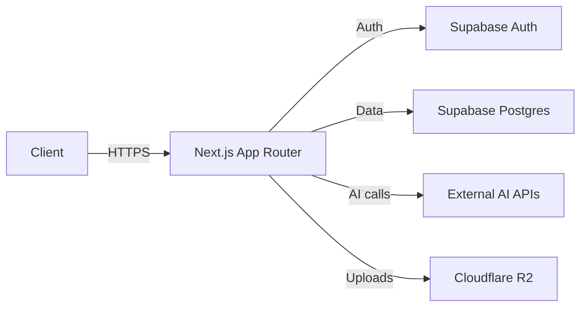
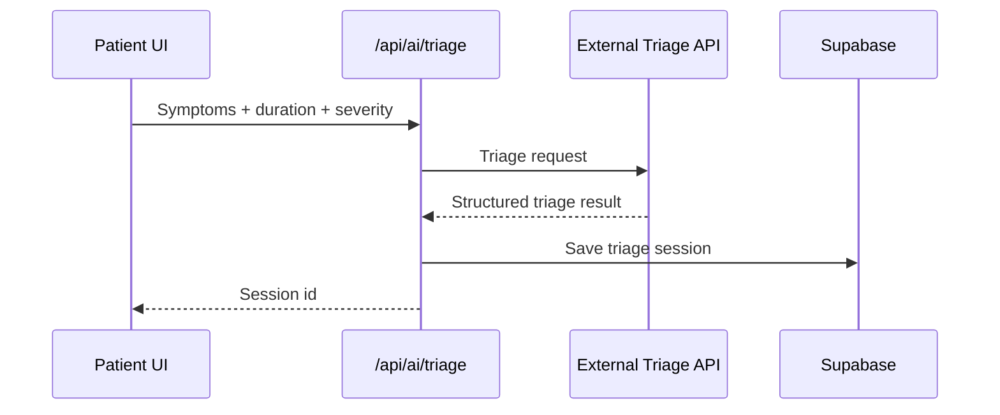
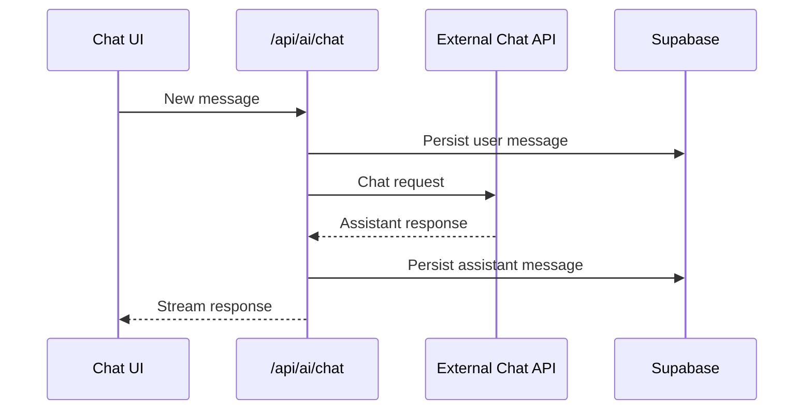

# Developer Guide

## Overview
Iasis AI is a Next.js (App Router) healthcare platform with Supabase (Auth + Postgres) and Cloudflare R2 for storage. The app is organized by role-based portals and server components.

## Tech stack
- Next.js App Router
- React
- Supabase (Auth, Postgres, RLS)
- Cloudflare R2 (asset storage)
- Tailwind CSS

## Setup
### Prerequisites
- Node.js 18+ (recommended)
- Supabase project (URL + anon key)
- R2 bucket and access keys

### Install and run
1) Install dependencies

```
npm install
```

2) Create env file

```
cp .env.example .env.local
```

3) Start the dev server

```
npm run dev
```

### Environment variables
- `NEXT_PUBLIC_SUPABASE_URL`
- `NEXT_PUBLIC_SUPABASE_PUBLISHABLE_KEY` (or `NEXT_PUBLIC_SUPABASE_ANON_KEY`)
- `SUPABASE_SERVICE_ROLE_KEY`
- `R2_ACCOUNT_ID`
- `R2_ACCESS_KEY_ID`
- `R2_SECRET_ACCESS_KEY`
- `R2_BUCKET_NAME`
- `R2_PUBLIC_URL`

## Architecture
### High-level flow


### Role routing and onboarding
```mermaid
flowchart TD
	A[User visits app] --> B{Authenticated?}
	B -- No --> L[Auth pages]
	B -- Yes --> C[Load profile role]
	C -->|admin| D[/admin]
	C -->|doctor| E[/doctor]
	C -->|clinic| F[/clinic]
	C -->|patient| G{Onboarded?}
	G -- No --> H[/onboarding]
	G -- Yes --> I[/app]
```

## App structure
- `app/`: Routes (App Router). Role portals are under `app/app`, `app/doctor`, `app/clinic`, `app/admin`.
- `components/`: UI and feature components.
- `lib/`: Utilities, Supabase clients, AI prompt/schema.
- `app/api/`: Server routes for AI and uploads.

## Feature-to-page map (developer reference)
| Area | Feature | Page(s) |
| --- | --- | --- |
| Auth | Sign in / sign up / reset | `/auth/login`, `/auth/sign-up`, `/auth/forgot-password`, `/auth/update-password` |
| Onboarding | Patient profile setup | `/onboarding` |
| Patient | Dashboard | `/app` |
| Patient | AI triage | `/app/triage`, `/app/triage/new`, `/app/triage/[id]` |
| Patient | AI chat | `/app/chat`, `/app/chat/[id]` |
| Patient | Appointments | `/app/appointments`, `/app/appointments/new` |
| Patient | Care directory | `/app/clinics` |
| Patient | Prescriptions | `/app/prescriptions`, `/app/prescriptions/[id]` |
| Patient | Lab reports | `/app/lab-reports`, `/app/lab-reports/[id]` |
| Patient | Records | `/app/records` |
| Patient | Reminders | `/app/reminders` |
| Patient | Mental health | `/app/mental-health`, `/app/mental-health/phq9`, `/app/mental-health/gad7` |
| Patient | Family | `/app/family` |
| Patient | Emergency | `/app/emergency` |
| Patient | Notifications | `/app/notifications` |
| Patient | Billing | `/app/billing` |
| Patient | Settings | `/app/settings` |
| Patient | Support | `/app/support` |
| Doctor | Overview | `/doctor` |
| Doctor | Appointments | `/doctor/appointments`, `/doctor/appointments/[id]` |
| Doctor | Patients | `/doctor/patients`, `/doctor/patients/[id]` |
| Doctor | Prescriptions | `/doctor/prescriptions`, `/doctor/prescriptions/new` |
| Doctor | Settings | `/doctor/settings` |
| Clinic | Overview | `/clinic` |
| Clinic | Upload reports | `/clinic/upload` |
| Clinic | Reports | `/clinic/reports` |
| Clinic | Settings | `/clinic/settings` |
| Admin | Overview | `/admin` |
| Admin | Users | `/admin/users` |
| Admin | Doctors | `/admin/providers` |
| Admin | Clinics | `/admin/clinics` |
| Admin | AI models | `/admin/ai-models` |
| Admin | Analytics | `/admin/analytics` |
| Admin | Reports | `/admin/reports` |
| Admin | Support | `/admin/support` |
| Admin | Pricing | `/admin/pricing` |
| Admin | System CMS | `/admin/system` |
| Admin | Data manager | `/admin/data` |

## Core workflows
### Auth and role sync
- Supabase Auth manages sessions.
- `/auth/callback` exchanges auth code, ensures a `profiles` row exists, and syncs role.

### Patient onboarding
- Patients must complete onboarding before accessing `/app`.

### AI triage


### AI chat


### File uploads (R2)
- Avatar uploads: `/api/profile/avatar-upload-url`
- Branding uploads: `/api/admin/branding/upload-url`

## Deployment notes
- Never expose `SUPABASE_SERVICE_ROLE_KEY` to the client.
- Configure R2 public URL with no trailing slash.

## Suggested reading
- `README.md` for project overview and setup.
- `iasis_ai_prd.md` for product architecture and requirements.
