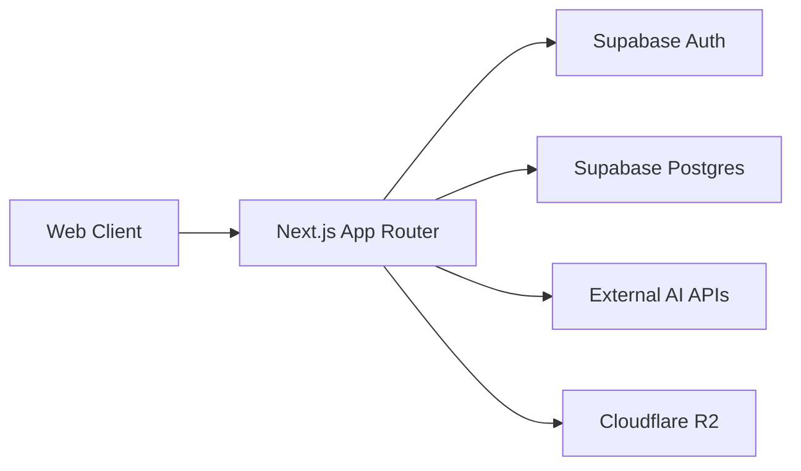
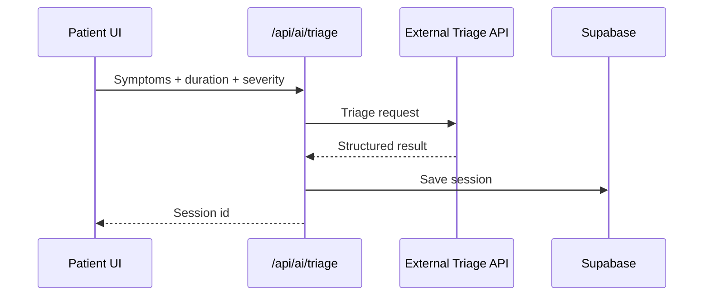
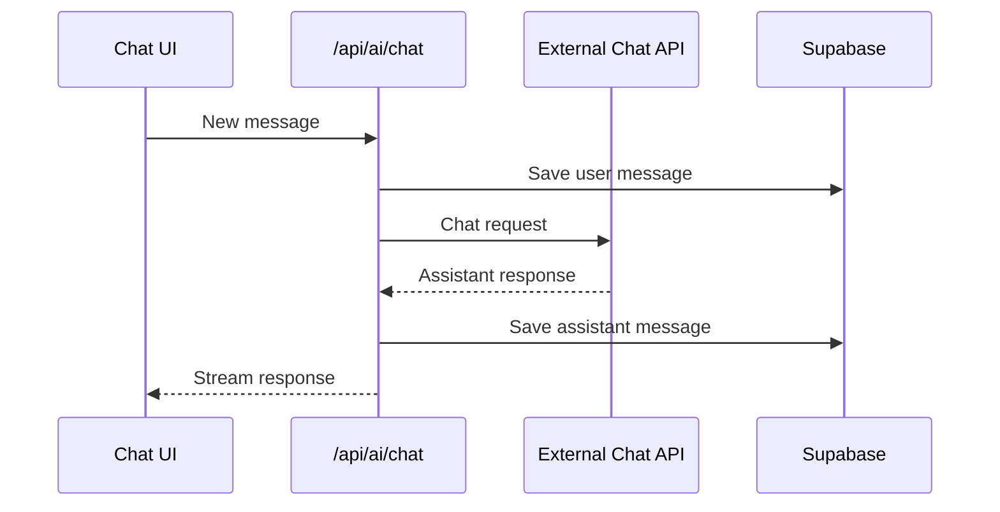
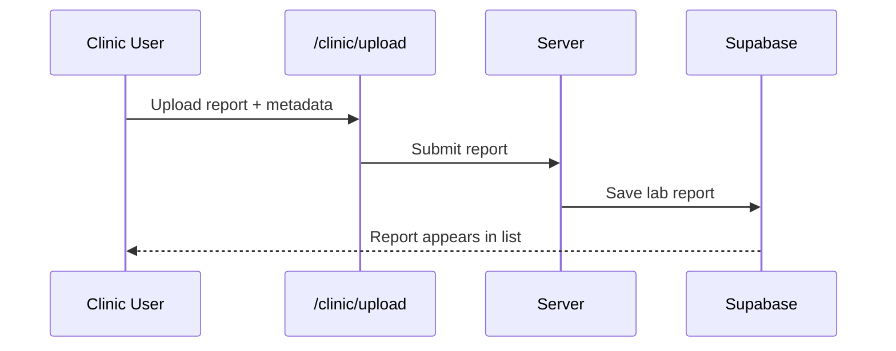
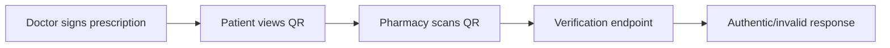

# Master Documentation

## Purpose
This document provides a single, professional reference for the Iasis AI platform: architecture, roles, pages, features, and operational flows.

## System overview
Iasis AI is a role-based healthcare platform built on Next.js App Router with Supabase (Auth + Postgres) and Cloudflare R2 for storage. Users are routed into dedicated portals for patient, doctor, clinic, and admin.

## Architecture


## Setup (local development)
### Prerequisites
- Node.js 18+
- Supabase project (URL + anon key)
- Cloudflare R2 bucket and access keys

### Quick start
1) Install dependencies

```
npm install
```

2) Create env file

```
cp .env.example .env.local
```

3) Start the dev server

```
npm run dev
```

### Environment variables
- `NEXT_PUBLIC_SUPABASE_URL`
- `NEXT_PUBLIC_SUPABASE_PUBLISHABLE_KEY` (or `NEXT_PUBLIC_SUPABASE_ANON_KEY`)
- `SUPABASE_SERVICE_ROLE_KEY`
- `R2_ACCOUNT_ID`
- `R2_ACCESS_KEY_ID`
- `R2_SECRET_ACCESS_KEY`
- `R2_BUCKET_NAME`
- `R2_PUBLIC_URL`

## Roles and portals
- Patient: `/app`
- Doctor: `/doctor`
- Clinic/Lab: `/clinic`
- Admin: `/admin`

## Feature map by role
### Patient
| Area | Feature | Page(s) |
| --- | --- | --- |
| Home | Dashboard | `/app` |
| AI | Triage | `/app/triage`, `/app/triage/new`, `/app/triage/[id]` |
| AI | Chat | `/app/chat`, `/app/chat/[id]` |
| Care | Appointments | `/app/appointments`, `/app/appointments/new` |
| Care | Find clinics/doctors | `/app/clinics` |
| Records | Prescriptions | `/app/prescriptions`, `/app/prescriptions/[id]` |
| Records | Lab reports | `/app/lab-reports`, `/app/lab-reports/[id]` |
| Records | Medical record | `/app/records` |
| Daily | Reminders | `/app/reminders` |
| Wellness | Mental health | `/app/mental-health`, `/app/mental-health/phq9`, `/app/mental-health/gad7` |
| Family | Dependents | `/app/family` |
| Safety | Emergency | `/app/emergency` |
| Notifications | Inbox | `/app/notifications` |
| Billing | Plans | `/app/billing` |
| Settings | Profile/health record | `/app/settings` |
| Support | Tickets | `/app/support` |

### Doctor
| Area | Feature | Page(s) |
| --- | --- | --- |
| Overview | Daily snapshot | `/doctor` |
| Care | Appointments | `/doctor/appointments`, `/doctor/appointments/[id]` |
| Care | Patients | `/doctor/patients`, `/doctor/patients/[id]` |
| Care | Prescriptions | `/doctor/prescriptions`, `/doctor/prescriptions/new` |
| Profile | Doctor settings | `/doctor/settings` |

### Clinic/Lab
| Area | Feature | Page(s) |
| --- | --- | --- |
| Overview | Reports summary | `/clinic` |
| Labs | Upload report | `/clinic/upload` |
| Labs | Reports list | `/clinic/reports` |
| Profile | Clinic settings | `/clinic/settings` |

### Admin
| Area | Feature | Page(s) |
| --- | --- | --- |
| Overview | Platform snapshot | `/admin` |
| Users | Role management | `/admin/users` |
| Providers | Doctors | `/admin/providers` |
| Providers | Clinics | `/admin/clinics` |
| AI | Model config | `/admin/ai-models` |
| Analytics | Counts | `/admin/analytics` |
| Reports | Weekly metrics | `/admin/reports` |
| Support | Ticket ops | `/admin/support` |
| Pricing | Pricing CMS | `/admin/pricing` |
| System | CMS + branding | `/admin/system` |
| Data | Data manager | `/admin/data` |
| Admin | Settings | `/admin/settings` |

## Core workflows
### Auth and role routing
```mermaid
flowchart TD
  A[User visits app] --> B{Authenticated?}
  B -- No --> C[Auth pages]
  B -- Yes --> D[Load profile role]
  D -->|admin| E[/admin]
  D -->|doctor| F[/doctor]
  D -->|clinic| G[/clinic]
  D -->|patient| H{Onboarded?}
  H -- No --> I[/onboarding]
  H -- Yes --> J[/app]
```

### AI triage


### AI chat


### Clinic report upload


### Prescription verification


## API and storage
- AI routes: `/api/ai/chat`, `/api/ai/triage`
- Uploads: `/api/profile/avatar-upload-url`, `/api/admin/branding/upload-url`
- Storage: Cloudflare R2 with public URLs saved in database

## Security notes
- Never expose `SUPABASE_SERVICE_ROLE_KEY` to the client.
- Use RLS in Supabase to scope access to user-owned records.

## Related docs
- `docs/developer.md`
- `docs/user-admin.md`
- `docs/user-doctor.md`
- `docs/user-clinic.md`
- `docs/user-patient.md`
- `iasis_ai_prd.md`
