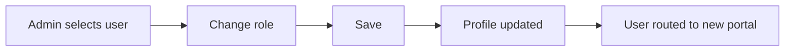
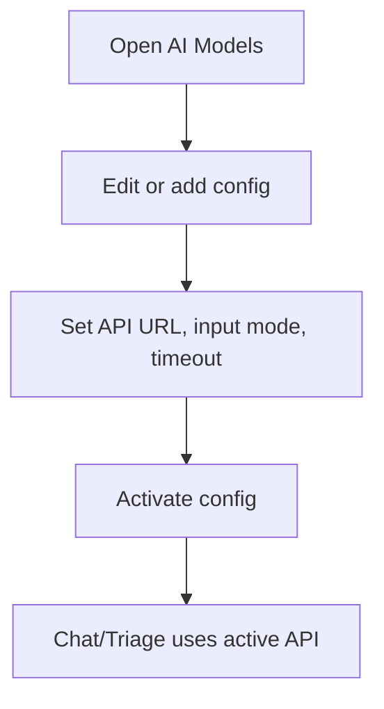
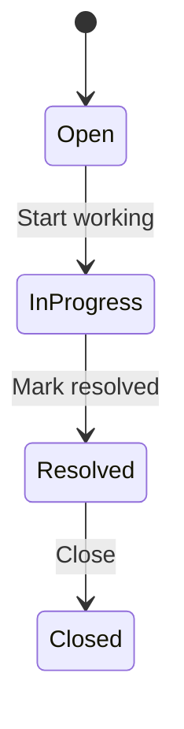

# Admin Guide

## Who this is for
Super admins managing the platform, users, providers, content, and system settings.

## Access
- Admin access is enforced by `profiles.role = admin`.
- Non-admins are redirected to their portal.

## Page-to-feature map
| Page | Purpose | Key actions |
| --- | --- | --- |
| `/admin` | Platform overview | Review snapshot metrics, jump to key areas |
| `/admin/users` | User management | Search by email, change roles, delete users |
| `/admin/providers` | Doctor registry | Review BMDC details, remove doctors |
| `/admin/clinics` | Clinic registry | Review clinic listings, remove clinics |
| `/admin/ai-models` | AI config | Set API endpoints, input types, timeouts |
| `/admin/analytics` | Analytics | View platform-wide counts |
| `/admin/reports` | Weekly report | View 7-day activity metrics |
| `/admin/support` | Support | Advance ticket status and review details |
| `/admin/pricing` | Pricing CMS | Create and edit public pricing plans |
| `/admin/system` | System CMS | Branding, site config, contact details |
| `/admin/data` | Data manager | Table-level access and bulk review |
| `/admin/settings` | Admin profile | Profile, password, add admins |

## Core workflows
### Role changes

### AI model configuration

### Support ticket lifecycle

## Notes
- Some sections are marked "Coming soon" and may not be fully functional yet.
