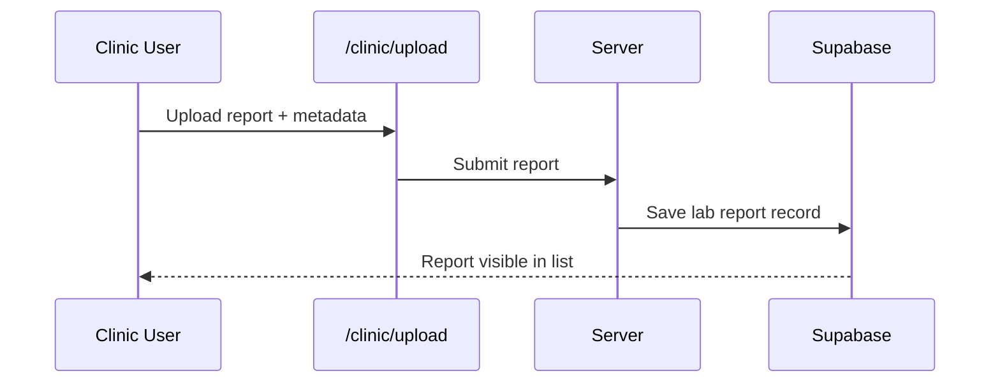

# Clinic / Diagnostic Lab Guide

## Who this is for
Clinics and diagnostic labs uploading reports and managing their public listing.

## Access
- Clinic access is enforced by `profiles.role = clinic`.

## Page-to-feature map
| Page | Purpose | Key actions |
| --- | --- | --- |
| `/clinic` | Overview | View report totals and recent uploads |
| `/clinic/upload` | Upload lab report | Submit patient lab report and metadata |
| `/clinic/reports` | Reports | Review submitted reports and AI summaries |
| `/clinic/settings` | Clinic profile | Update services, address, and contact info |

## Core workflow
### Lab report upload

## Notes
- Uploaded reports are immutable after submission.
