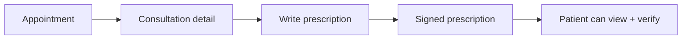

# Doctor Guide

## Who this is for
BMDC-verified doctors using the doctor portal.

## Access
- Doctor access is enforced by `profiles.role = doctor`.

## Page-to-feature map
| Page | Purpose | Key actions |
| --- | --- | --- |
| `/doctor` | Overview | Daily metrics and upcoming appointments |
| `/doctor/appointments` | Appointments | Review upcoming and past consultations |
| `/doctor/appointments/[id]` | Consultation detail | View patient info, notes, launch video room |
| `/doctor/patients` | Patients | View roster of patients you have seen |
| `/doctor/patients/[id]` | Patient detail | View appointments and prescriptions for a patient |
| `/doctor/prescriptions` | Prescriptions | Review signed prescriptions |
| `/doctor/prescriptions/new` | Write prescription | Create a signed digital prescription |
| `/doctor/settings` | Doctor profile | Manage specialty, fees, availability |

## Core workflows
### Consultation to prescription


### Video consultation
```mermaid
flowchart TD
	A[Appointment detail] --> B[Open call]
	B --> C[Video room (coming soon)]
```

## Notes
- Video consultation room is marked "Coming soon".
