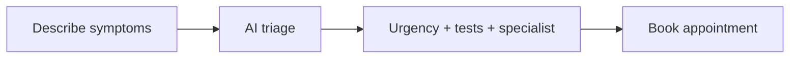
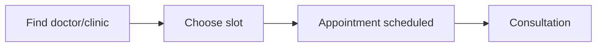
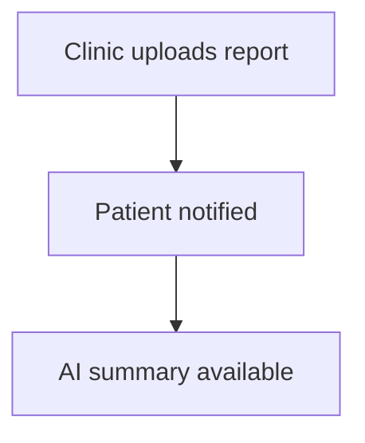

# Patient Guide

## Who this is for
Patients and citizens using the main Iasis app.

## Access and setup
- Patients must complete onboarding before accessing `/app`.
- Health profile data is editable anytime in Settings.

## Page-to-feature map
| Page | Purpose | Key actions |
| --- | --- | --- |
| `/app` | Home dashboard | Quick actions for triage, chat, appointments, reminders |
| `/app/triage` | AI triage list | View past symptom checks |
| `/app/triage/new` | AI triage intake | Start a new symptom check |
| `/app/triage/[id]` | Triage result | Review urgency, tests, and specialist |
| `/app/chat` | AI chat list | Start or open chats |
| `/app/chat/[id]` | AI chat detail | Chat with Iasis AI |
| `/app/appointments` | Appointments | Review upcoming and past visits |
| `/app/appointments/new` | Booking | Book a consultation |
| `/app/clinics` | Find care | Search clinics and doctors |
| `/app/prescriptions` | Prescriptions | View signed prescriptions |
| `/app/prescriptions/[id]` | Prescription detail | View QR verification |
| `/app/lab-reports` | Lab reports | View lab results and AI summaries |
| `/app/lab-reports/[id]` | Lab report detail | View AI summary and PDF |
| `/app/records` | Medical record | View consolidated health record |
| `/app/reminders` | Reminders | Add and manage medicine reminders |
| `/app/mental-health` | Mental health | Mood logs and assessments |
| `/app/mental-health/phq9` | PHQ-9 | Depression screen |
| `/app/mental-health/gad7` | GAD-7 | Anxiety screen |
| `/app/family` | Family | Manage dependents |
| `/app/emergency` | Emergency | Manage SOS contacts and alerts |
| `/app/notifications` | Notifications | Unified event feed |
| `/app/billing` | Plans and billing | View plan options |
| `/app/settings` | Settings | Update profile and health record |
| `/app/support` | Support | Submit and track tickets |

## Core workflows
### AI triage

### Appointment booking

### Lab report access

## Notes
- Some areas are marked "Coming soon" (telemedicine, medicines, pharmacies).
